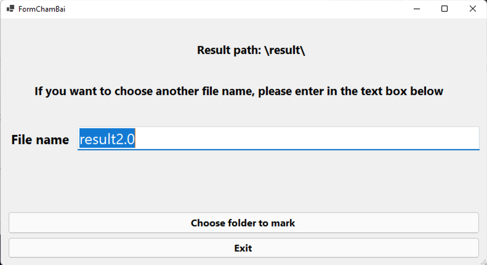
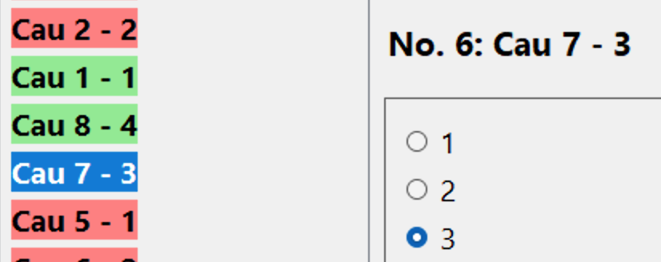

# CS202 Final Report

## Thông tin cá nhân

- Student Id: 2059020
- Name: Nguyen Tran Tuan Kiet
- Class: 20BIT1
- Email: 2059020@itec.hcmus.edu.vn

---

## Tự đánh giá

| Module | Chức năng | Check | 
|---|---|---|
| Soạn đề | Soạn câu hỏi | Hoàn thành |
| Soạn đề | Tạo đề | Hoàn thành |
| Soạn đề | Chấm bài | Hoàn thành |
| Thi | Làm bài | Hoàn thành |

---

## Giải thích cụ thể

### **Module Soạn Đề** 

Khởi động module này sẽ là form validation để có thể kiểm tra thông tin của người dùng. Các giáo viên sẽ được cấp username và mật khẩu riêng. Để demo, username và mật khẩu hiện tại là:

- Username: kietnguyen
- Password: 123456789

Sau khi nhập đầy đủ thông tin, người dùng có thể ấn nút *Login* hoặc phím *Enter* để vào bên trong. Form có hỗ trợ hiện thông báo và chặn nếu người dùng đăng nhập với thông tin sai.

Giao diện chính của module **soạn đề** sẽ có 4 nút bấm. Nút trên cùng *Create Question* để soạn câu hỏi, *Create Test* để tạo để, và *Mark Test* để chấm bài. Có thêm nút *Exit* trong trường hợp người dùng muốn thoát khỏi chương trình.

### Chức năng soạn câu hỏi 

Đây là giao diện người dùng nhìn thấy khi vào chức năng soạn câu hỏi. Ở giữa có một *List Box* để hiển thị danh sách tên các câu hỏi. Danh sách này được lưu ở thư mục 

> bank\dataQuestion.xml

ở trong thư mục thực hiện chương trình đã biên dịch. Có các nút cơ bản tương ứng với các chức năng là:

1. ***Add Question***: Thêm mới câu hỏi
2. ***Update Question***: Cập nhật câu hỏi
3. ***Delete Question***: Xoá câu hỏi
4. ***Save to file***: Lưu danh sách câu hỏi về file trên
5. ***Exit***: Lưu và thoát 

Chức năng thêm mới câu hỏi sẽ mở ra một form mới giúp người dùng có thể tuỳ chỉnh câu hỏi của bản thân nhiều hơn. 

*Form Cau Hoi* ày bao gồm 1 *Combo Box* để người dùng lựa chọn lĩnh vực cho câu hỏi của mình, 1 *Text Box* để nhập câu hỏi, 2 *Button* để lưu và thoát, và một *User Control* để hiện tuỳ chỉnh các câu trả lời.

*User Control* này có chức năng tương tự với form trước, đó là:

1. ***Add Answer***: Thêm mới câu trả lời
2. ***Update Answer***: Cập nhật câu trả lời
3. ***Delete Answer***: Xoá câu trả lời
4. ***Make Correct***: Chỉ định câu trả lời đúng

Khi người dùng thoát cả hai form trên, nếu người dùng chọn lưu, tập các câu hỏi sẽ tự động được lưu lại.

### Chức năng tạo đề

Chức năng tạo đề được chia làm hai loại, ngẫu nhiên và tự chọn. Các điểm chính trong form này là:

1. ***Number of Questions***: Chỉ định số câu hỏi muốn ngẫu nhiên, tất nhiên chỉ có thể ngẫu nhiên khi số lượng điền vào nhỏ hơn số lượn câu hỏi có sẵn trong thư viện.
2. ***Randomize***: Tiến hành quá trình ngẫu nhiên
3. ***List Box trái***: Lưu các câu hỏi có trong thư viện
4. ***List Box Phải***: Lưu các câu hỏi được lựa chọn
5. ***View Question***: Xem câu hỏi ở trong *List Box trái*, Form Cau Hoi sẽ được hiện lên nhưng khoá tất cả chức năng để người dùng không thể thay đổi được gì.
6. ***Add Question***: Thêm thủ công câu hỏi
7. ***Delete***: Xoá câu hỏi bên *List Box phải*
8. ***Clear***: Xoá tất cả câu hỏi bên *List Box phải*
9. ***Month và Year***: Luu thời gian dự định cho bài thi
10. ***Save to file***: Lưu bài thi
11. ***Exit***: Thoát

Các bài thi và đáp án sẽ được lưu dười định dạng .xml vào hai folder

> /test/

> /answer/

ở trong thư mục thực hiện chương trình đã biên dịch. 

### Chức năng chấm bài

*Form Cham Bai* thực hiện đúng chức năng của nó, form cho phép người dùng nhập vào tên file khi xuất điểm (không cần định dạng .txt vì chương trình sẽ tự gán). Sau đó, người dùng có thể chọn một folder bất kỳ để chấm tất cả các bài thi trong folder đó.

Chương trình sẽ tiến hành lấy các file đáp án trong thư mục */answer/*, đối chiếu mã đề, chấm và lưu về folder:

> /result/

ở trong thư mục thực hiện chương trình đã biên dịch. 

Điểm sẽ được quy về thang điểm 10 và được xuất ra file .txt theo thứ tự giảm dần với các thông tin như id bài thi, tháng thi, năm thi, id nhân viên, tên nhân viên.

---

### **Module thi**

Module này sẽ được bắt đầu với một *Form Thi*. Form này có chức năng để người dùng chọn file test định dạng .xml. Người dùng sẽ tiến hành nhập id, tên, và email rồi ấn bắt đầu đề làm bài.

Khi ấn bắt đầu, bài thi sẽ được tính giờ ngay lập tức với 15 giây 1 câu hỏi.  

### Chức năng làm bài 

*Form Lam Bai* sẽ được mở và có giao diện như trên. Form này có những chức năng chính là: 

1. ***Đồng hồ***: Hiển thị thời gian đếm ngược của bài thi
2. ***Label***: Hiển thị câu hỏi
3. ***List View trái***: Hiển thị các câu hỏi
4. ***User Control phải hiện câu trả lời***: Lưu lựa chọn của các câu trả lời dưới dạng *Radio Button*
5. ***Highlight***: Đánh dấu câu hỏi cần chú ý, câu hỏi sẽ được chuyển sang màu vàng
6. ***Unhighlight***: Bỏ đánh dấu câu hỏi
7. ***Previous***: Đi về câu hỏi trước
8. ***Next***: Đi về câu hỏi sau
9. ***Finish***: Hoàn thành và lưu bài vào một folder bất kỳ

Các câu hỏi chưa được thực hiện sẽ có màu đỏ, được thực hiện rồi sẽ có màu xanh, và khi được đánh dấu sẽ có màu vàng.

Người dùng còn có thể dùng chuột phải nhấn vào câu hỏi để hiện ra *Context Menu* cũng hỗ trợ việc đánh dấu và bỏ đánh dấu câu hỏi như sau.

File bài thi được lưu với định dạng .xml.

___

## Các hệ class chính

### Hệ IQCollection 

Dùng để lưu trữ thông tin các dạng tập câu hỏi. Có 3 loại chính là:

- ***NormalQCCollection***: Dùng lưu tập các câu hỏi
- ***TestQCCollection***: Dùng lưu bài thi
- ***EmTestQCCOllection***: Dùng lưu bài thi và thông tin nhân viên

### Hệ IXMLExecuter

Dùng để chuyển hoá các hệ IQCollection thành các file .xml. Có 4 loại chính:

- ***NormalXMLExecuter***: Dùng cho *NormalQCCollection*
- ***TestXMLExecuter***: Dùng cho *TestQCollection* 
- ***EmployeeTestXMLExecuter***: Dùng cho *EmTestQCollection*
- ***CorrectAnswerXMLExecuter***: Dùng cho *TestQCollection*

Các method của hệ IXMLExecuter này được lưu vào một tập các object để có thể tuỳ biến dựa vào từng trường hợp, áp dụng Strategy Design Pattern. Việc này cũng giúp giảm đi một lượng lớn code.  

1 đến 5 là các bước thực hiện xử lý file .xml với hệ IQCollection.

___

## Nguồn tham khảo:

- *User Control EClock*: Thầy giáo Nguyễn Đức Huy trường Đại học Khoa Học Tự Nhiên Thành phố Hồ Chí Minh
